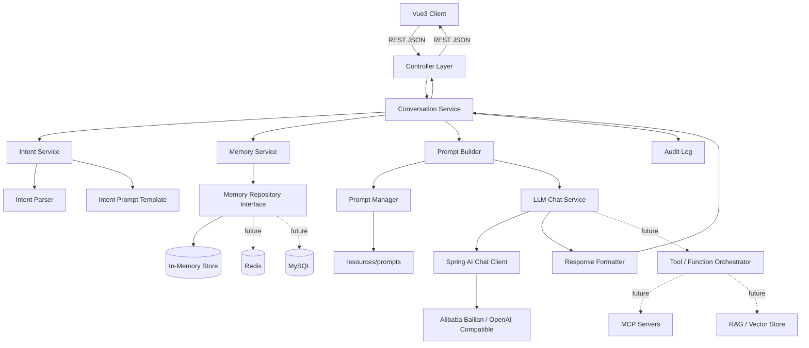
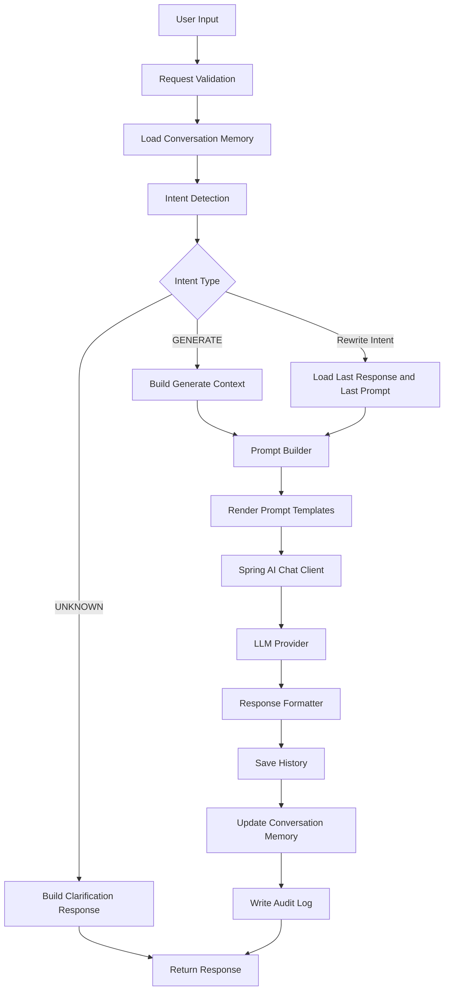

# 深圳市气象短临预报 AI Assistant 架构设计文档

版本：v1.0  
阶段：第一阶段 - 软件设计  
技术栈：Java 21、Spring Boot 3.x、Spring AI、Maven、Vue3、RESTful API  
定位：企业级 AI 应用工程化设计文档，不包含业务代码

## 1. 项目背景

### 1.1 为什么设计这个系统

深圳短临天气预报需要面向公众、值班人员、业务主管、应急联动单位等不同对象输出不同风格的预报文本。传统方式通常依赖人工整理雷达、降雨、区域影响、风险提示等信息，再手工改写为正式、简明、专业或面向公众的版本。

大模型可以提升文本生成效率，但如果只是把气象数据拼成一段文本后调用 LLM，会出现以下问题：

- 缺少可追踪的 Prompt 管理，结果不可复现。
- 连续修改时容易丢失上下文，用户说“简单一点”“把雨量调大一点”时，系统不知道是在修改哪一次预报。
- 用户意图没有结构化，后续无法统计、审计和优化。
- LLM 供应商、模型、Prompt、记忆存储与业务层强耦合，后续接入 RAG、MCP、Tool Calling 成本高。
- 生成结果缺少格式约束和审计信息，难以用于真实生产流程。

因此本系统被设计为一个具备 Prompt 管理、多轮对话、Intent Recognition、Conversation Memory、LLM 网关抽象和可审计能力的 AI 应用，而不是简单的大模型调用 Demo。

### 1.2 业务价值

- 提升短临预报文案生成效率，降低重复改写成本。
- 统一气象预报文本风格，减少不同人员之间的表达差异。
- 支持连续修改和版本追踪，保留“原始气象上下文、用户意图、Prompt 版本、LLM 响应”的完整链路。
- 支持未来接入雷达外推、格点预报、历史个例、灾害风险知识库等能力。
- 为面试、技术评审和真实企业项目落地展示 AI 工程化能力。

### 1.3 适用场景

- 短临天气预报初稿生成。
- 已生成预报的语气、长度、专业程度、风险提示调整。
- 值班场景下的多轮预报协作。
- 面向不同渠道生成差异化版本，例如公众短信、政务通报、业务简报、应急提醒。
- 后续扩展为自动引用实时雷达、雨量站、预警信号、历史相似个例的智能预报助手。

### 1.4 系统边界

系统负责：

- 接收结构化气象上下文和用户自然语言指令。
- 识别用户意图。
- 管理会话上下文和历史版本。
- 按 Prompt 模板构建 LLM 请求。
- 调用 Spring AI Chat Client。
- 格式化并返回结构化响应。
- 记录日志、审计、Token、耗时、Prompt 版本等工程化信息。

系统不负责：

- 直接生产原始雷达、卫星、数值模式数据。
- 代替气象预报员做最终业务签发。
- 训练气象专用大模型。
- 在第一阶段实现实时数据接入、RAG、MCP、Function Calling、Tool Calling。

### 1.5 非目标

- 第一阶段不写业务代码。
- 第一阶段不实现前端页面。
- 第一阶段不接入真实 MySQL、Redis、Kafka。
- 第一阶段不实现模型微调。
- 第一阶段不承诺 LLM 输出 100% 正确，最终文本仍需业务人员审核。

## 2. 整体架构图



### 2.1 架构说明

系统采用前后端分离架构。Vue3 负责交互，Spring Boot 负责业务编排、Prompt 构建、会话记忆、意图识别和 LLM 调用。LLM 能力通过 `LLM Chat Service` 和 Spring AI 抽象，不直接散落在 Controller 或业务 Service 中。

这样设计的原因：

- Controller 只处理 HTTP 协议，不理解 Prompt 和模型细节。
- Conversation Service 是业务编排中心，统一处理生成、改写、保存历史、返回结果。
- Intent、Prompt、Memory、LLM 分别独立，便于替换和测试。
- Tool Calling、Function Calling、RAG、MCP 作为 LLM 层能力扩展，不侵入天气预报业务层。
- Prompt 文件放在资源目录，支持版本化、评审、灰度和回滚。

## 3. 模块划分

| 模块 | 职责 | 通信方式 | 设计原因 |
| --- | --- | --- | --- |
| Controller | 接收 REST 请求、参数校验、返回统一响应 | 调用 Application/Service 层 DTO | 保持 HTTP 适配层简单，避免业务逻辑泄露到接口层 |
| Service | 编排业务流程，如生成预报、连续改写、重置会话 | 通过领域对象和 DTO 与各子服务通信 | 形成清晰的应用服务边界，便于测试和扩展 |
| Prompt | 管理 Prompt 模板加载、渲染、版本、变量替换 | 被 Prompt Builder 调用 | Prompt 不写入 Java，支持独立评审和热更新扩展 |
| Intent | 识别用户输入属于生成、简化、正式化、雨量调整等意图 | 返回结构化 IntentResult | 把自然语言输入变为可审计、可路由的业务指令 |
| Conversation | 管理会话生命周期、当前上下文、版本链路 | 调用 Memory、Intent、Prompt、LLM | 支持多轮连续修改，不把每次请求当成孤立聊天 |
| Memory | 保存 Session、History、Last Prompt、Last Weather Data、Last Response | 通过 MemoryRepository 接口读写 | 当前可用内存实现，未来平滑替换 Redis/MySQL |
| LLM | 封装 Spring AI Chat Client、模型参数、超时、重试、Token 统计 | 接收 ChatRequest，返回 AIResponse | 隔离模型供应商差异，支持阿里百炼/OpenAI Compatible |
| DTO | 定义 API 入参出参，如 WeatherGenerateRequest、ChatRequest | Controller 与 Service 间传输 | 避免接口直接暴露领域对象，利于接口版本演进 |
| Parser | 解析 Intent、LLM 输出、结构化 JSON、气象文本片段 | 被 Intent 或 Response Formatter 调用 | 防止字符串处理散落在各处，降低维护成本 |
| Config | Spring AI、模型、Prompt、跨域、日志、鉴权配置 | 被 Spring 容器注入 | 集中管理外部化配置，符合 Spring Boot 最佳实践 |
| Util | 通用工具，如 TraceId、Token 估算、时间格式、文本清洗 | 被低层或横切逻辑调用 | 仅放无业务含义的工具，避免 Util 变成业务垃圾桶 |

### 3.1 模块通信原则

- Controller 只能调用应用服务，不直接调用 Prompt、Memory、LLM。
- Conversation Service 负责流程编排，但不直接拼接 Prompt 文本。
- Prompt Builder 只构建 Prompt，不调用 LLM。
- Intent Service 只识别意图，不修改会话状态。
- Memory Service 通过 Repository 接口操作存储，业务层不感知 Redis/MySQL。
- LLM Chat Service 只处理模型调用、参数和响应元数据，不理解前端页面。

### 3.2 为什么这样设计

该拆分让系统保持高内聚、低耦合：

- 用户意图变化时，只扩展 Intent 模块。
- Prompt 策略变化时，只调整 Prompt 模板和 Builder。
- 模型供应商变化时，只替换 LLM Chat Service 配置或适配器。
- 会话存储从内存切到 Redis 时，只替换 MemoryRepository。
- 接入 RAG/MCP/Tool Calling 时，在 LLM 能力层扩展，不修改 Controller 和核心业务 API。

## 4. 目录结构

```text
meteorological_agent
├── README.md
├── docs
│   └── ARCHITECTURE.md
├── pom.xml
├── src
│   ├── main
│   │   ├── java
│   │   │   └── com
│   │   │       └── shenzhen
│   │   │           └── meteorologicalagent
│   │   │               ├── MeteorologicalAgentApplication.java
│   │   │               ├── common
│   │   │               │   ├── ApiResponse.java
│   │   │               │   ├── ErrorCode.java
│   │   │               │   └── exception
│   │   │               ├── config
│   │   │               │   ├── AiModelProperties.java
│   │   │               │   ├── CorsConfig.java
│   │   │               │   ├── PromptProperties.java
│   │   │               │   └── WebConfig.java
│   │   │               ├── controller
│   │   │               │   ├── WeatherController.java
│   │   │               │   └── ConversationController.java
│   │   │               ├── dto
│   │   │               │   ├── request
│   │   │               │   └── response
│   │   │               ├── entity
│   │   │               │   ├── ConversationEntity.java
│   │   │               │   ├── ConversationHistoryEntity.java
│   │   │               │   ├── PromptVersionEntity.java
│   │   │               │   └── AuditLogEntity.java
│   │   │               ├── domain
│   │   │               │   ├── weather
│   │   │               │   │   ├── WeatherContext.java
│   │   │               │   │   ├── RadarInfo.java
│   │   │               │   │   ├── RainForecast.java
│   │   │               │   │   └── RegionForecast.java
│   │   │               │   ├── conversation
│   │   │               │   │   ├── Conversation.java
│   │   │               │   │   ├── ConversationMessage.java
│   │   │               │   │   └── ConversationSnapshot.java
│   │   │               │   └── ai
│   │   │               │       ├── AIResponse.java
│   │   │               │       └── IntentResult.java
│   │   │               ├── parser
│   │   │               │   ├── IntentResultParser.java
│   │   │               │   ├── LlmResponseParser.java
│   │   │               │   └── WeatherContextParser.java
│   │   │               ├── service
│   │   │               │   ├── WeatherApplicationService.java
│   │   │               │   ├── chat
│   │   │               │   │   ├── LlmChatService.java
│   │   │               │   │   ├── SpringAiChatService.java
│   │   │               │   │   └── ToolOrchestrator.java
│   │   │               │   ├── conversation
│   │   │               │   │   ├── ConversationService.java
│   │   │               │   │   └── ConversationVersionService.java
│   │   │               │   ├── intent
│   │   │               │   │   ├── IntentService.java
│   │   │               │   │   ├── RuleBasedIntentRecognizer.java
│   │   │               │   │   └── LlmIntentRecognizer.java
│   │   │               │   ├── memory
│   │   │               │   │   ├── MemoryService.java
│   │   │               │   │   ├── MemoryRepository.java
│   │   │               │   │   ├── InMemoryRepository.java
│   │   │               │   │   └── RedisMemoryRepository.java
│   │   │               │   └── prompt
│   │   │                   ├── PromptManager.java
│   │   │                   ├── PromptBuilder.java
│   │   │                   ├── PromptTemplate.java
│   │   │                   └── PromptVersionService.java
│   │   │               └── util
│   │   │                   ├── TraceIdUtils.java
│   │   │                   ├── TextSanitizer.java
│   │   │                   └── TimeUtils.java
│   │   └── resources
│   │       ├── application.yml
│   │       ├── prompts
│   │       │   ├── system.md
│   │       │   ├── intent.md
│   │       │   ├── generate.md
│   │       │   ├── rewrite.md
│   │       │   └── explain.md
│   │       └── db
│   │           └── migration
│   └── test
│       └── java
│           └── com
│               └── shenzhen
│                   └── meteorologicalagent
└── web
    ├── package.json
    ├── vite.config.ts
    └── src
        ├── api
        ├── components
        ├── pages
        ├── stores
        └── types
```

### 4.1 扩展原则

- RAG：新增 `service/retrieval` 和向量库适配器，Conversation Service 只依赖检索结果抽象。
- MCP：新增 MCP Client 或 Tool Adapter，挂载到 `ToolOrchestrator`。
- Function Calling：在 `service/chat` 内部实现函数注册与执行，不污染业务 Controller。
- Tool Calling：工具调用结果转成结构化上下文，再交给 Prompt Builder。
- 多模型：在 `LlmChatService` 下按模型供应商实现策略或适配器。

## 5. AI Workflow



### 5.1 工作流说明

用户每次输入都会先加载会话上下文，再识别意图。系统不会把“简单一点”“专业一点”“把雨量调大一点”当成新问题，而是将其识别为对上一版预报的改写请求，并使用上一次 WeatherContext、Prompt、Response 和版本号构建 Rewrite Prompt。

这样可以保证连续修改是在同一业务上下文中演进，而不是每次重新开始聊天。

## 6. Conversation Memory

### 6.1 Memory 设计目标

- 支持多轮对话。
- 支持从上一版结果继续修改。
- 支持追踪 Prompt、天气数据、模型响应和版本。
- 支持当前阶段内存实现，未来平滑切换 Redis/MySQL。
- 支持审计和问题排查。

### 6.2 核心数据结构

#### Session

| 字段 | 类型 | 说明 |
| --- | --- | --- |
| sessionId | String | 前端或服务端生成的会话标识 |
| userId | String | 用户标识，未登录时可为空或使用匿名 ID |
| createdAt | LocalDateTime | 会话创建时间 |
| lastActiveAt | LocalDateTime | 最近活跃时间 |
| status | Enum | ACTIVE、EXPIRED、RESET |

#### Conversation

| 字段 | 类型 | 说明 |
| --- | --- | --- |
| conversationId | String | 一次预报任务的唯一标识 |
| sessionId | String | 所属 Session |
| title | String | 会话标题，可由首轮预报自动生成 |
| weatherContext | WeatherContext | 最近一次结构化天气上下文 |
| currentVersion | Integer | 当前版本号 |
| createdAt | LocalDateTime | 创建时间 |
| updatedAt | LocalDateTime | 更新时间 |

#### Conversation Memory Snapshot

| 字段 | 类型 | 说明 |
| --- | --- | --- |
| conversationId | String | 会话 ID |
| history | List<ConversationMessage> | 多轮消息历史 |
| lastPrompt | PromptSnapshot | 上一次完整 Prompt 快照 |
| lastWeatherData | WeatherContext | 上一次天气数据 |
| lastResponse | AIResponse | 上一次模型输出 |
| lastIntent | IntentResult | 上一次识别意图 |
| version | Integer | 当前版本 |
| promptVersion | String | Prompt 模板版本 |

#### ConversationMessage

| 字段 | 类型 | 说明 |
| --- | --- | --- |
| messageId | String | 消息 ID |
| role | Enum | USER、ASSISTANT、SYSTEM |
| content | String | 消息内容 |
| intent | IntentType | 用户消息对应意图 |
| version | Integer | 属于第几版预报 |
| createdAt | LocalDateTime | 创建时间 |

### 6.3 为什么保存 Last Prompt、Last Weather Data、Last Response

- `Last Prompt`：复现 LLM 调用，排查 Prompt 导致的问题。
- `Last Weather Data`：连续修改时不要求用户重复提交天气数据。
- `Last Response`：Rewrite 场景的基础文本，不重新生成无关内容。
- `Version`：每次修改形成版本链，方便回滚和审计。

### 6.4 Redis 扩展方案

当前可先使用 `InMemoryRepository`，未来切换 Redis 时保持接口不变：

- Key 设计：`weather:conversation:{conversationId}`。
- Value：JSON 序列化后的 Conversation Memory Snapshot。
- TTL：根据业务设置，例如 24 小时或 7 天。
- History 可使用 Redis List：`weather:conversation:{conversationId}:history`。
- 热数据放 Redis，最终审计数据异步落 MySQL。

业务层只依赖 `MemoryRepository` 接口，因此替换 Redis 不需要修改 Controller、Prompt Builder、Intent Service。

## 7. Intent Recognition

### 7.1 Intent 列表

| Intent | 含义 | 典型触发语 | 处理策略 |
| --- | --- | --- | --- |
| GENERATE | 基于天气上下文生成新预报 | “生成预报”“根据这些数据写一版” | 使用 Generate Prompt |
| SIMPLIFY | 简化现有预报 | “简单一点”“短一点”“精简一下” | 使用 Rewrite Prompt，压缩表达 |
| MORE_DETAIL | 增加细节 | “详细一点”“展开说明” | 使用 Rewrite Prompt，补充区域、时段、影响 |
| MORE_FORMAL | 更正式 | “正式一点”“公文一点” | 使用 Rewrite Prompt，调整为政务或业务口径 |
| MORE_CASUAL | 更口语 | “通俗一点”“面向公众” | 使用 Rewrite Prompt，降低术语密度 |
| INCREASE_RAIN | 调大雨量表达 | “雨量调大一点”“降雨更明显” | 修改 RainForecast 强度描述后重写 |
| DECREASE_RAIN | 调小雨量表达 | “雨量弱一点”“不要说得太严重” | 修改 RainForecast 强度描述后重写 |
| ADD_WARNING | 增加风险提示 | “加风险提示”“强调防御” | 在 Prompt 中加入 warning 要求 |
| REGENERATE | 重新生成同场景结果 | “重新生成”“换一种说法” | 使用相同 WeatherContext 和 Prompt 重新生成 |
| UNKNOWN | 无法识别 | “你是谁”“随便写点” | 返回澄清或引导，不直接生成业务预报 |

### 7.2 识别策略

Intent Recognition 采用分层策略：

1. 规则优先：对高频、明确、低风险的短语进行规则匹配，例如“简单一点”“正式一点”。
2. LLM 分类兜底：规则无法识别时，使用 `resources/prompts/intent.md` 让模型输出结构化 IntentResult。
3. 置信度控制：低置信度时返回 UNKNOWN 或要求用户补充。
4. 上下文修正：如果没有 `lastResponse`，用户输入“简单一点”不能执行 SIMPLIFY，需要提示先生成预报。

### 7.3 IntentResult 结构

| 字段 | 类型 | 说明 |
| --- | --- | --- |
| intent | IntentType | 识别出的意图 |
| confidence | BigDecimal | 置信度 |
| parameters | Map<String, Object> | 意图参数，如 rainAdjustment、tone、length |
| reason | String | 识别原因，便于调试和审计 |
| requiresExistingConversation | Boolean | 是否依赖已有预报 |

### 7.4 如何扩展 Intent

新增 Intent 时只需要：

- 增加 IntentType 枚举。
- 在规则识别器中增加高频触发语。
- 在 `intent.md` 中增加分类说明。
- 在 Prompt Builder 中增加对应 Prompt 参数映射。
- 增加单元测试和日志字段校验。

不需要修改 Controller API，也不需要改变 Memory 数据结构。

## 8. Prompt 管理方案

### 8.1 基本原则

- Prompt 不写入 Java 代码。
- 所有 Prompt 放在 `src/main/resources/prompts`。
- Prompt 文件进入 Git 管理，支持评审、版本和回滚。
- Prompt Builder 只负责选择模板、注入变量、拼接消息，不包含业务文案硬编码。
- Prompt 运行时需要记录模板名称、版本、变量摘要和最终长度。

### 8.2 Prompt 文件

| 文件 | 用途 |
| --- | --- |
| system.md | 系统角色、总体约束、气象预报输出原则 |
| intent.md | 意图识别 Prompt，要求输出结构化 IntentResult |
| generate.md | 首次生成预报 Prompt |
| rewrite.md | 基于上一版结果连续改写 Prompt |
| explain.md | 解释生成依据、说明文本变化原因 |

### 8.3 Prompt Builder 拼接策略

Generate 场景：

```text
System Prompt
+ Generate Prompt
+ WeatherContext
+ Output Format Instruction
+ Safety and Boundary Rules
```

Rewrite 场景：

```text
System Prompt
+ Rewrite Prompt
+ Last WeatherContext
+ Last Response
+ User Instruction
+ IntentResult Parameters
+ Output Format Instruction
```

Intent 场景：

```text
Intent Prompt
+ User Input
+ Conversation State Summary
+ Supported Intent List
+ JSON Output Schema
```

### 8.4 Prompt 版本管理

Prompt Version 需要记录：

- promptName
- version
- contentHash
- author
- createdAt
- status：DRAFT、ACTIVE、DEPRECATED
- changeLog

每次 LLM 调用都保存 `promptName + promptVersion + contentHash`，保证结果可追溯。

## 9. 领域模型

系统不直接在业务层传递裸 String，而是使用明确的领域对象表达业务含义。

### 9.1 WeatherContext

| 字段 | 类型 | 说明 |
| --- | --- | --- |
| city | String | 城市，默认深圳 |
| forecastTime | LocalDateTime | 预报发布时间 |
| validPeriod | String | 预报有效期，如未来 0-3 小时 |
| radarInfo | RadarInfo | 雷达回波信息 |
| rainForecast | RainForecast | 降雨预报 |
| regionForecasts | List<RegionForecast> | 分区预报 |
| riskSignals | List<String> | 风险信号或业务提示 |
| dataSource | String | 数据来源 |

### 9.2 RadarInfo

| 字段 | 类型 | 说明 |
| --- | --- | --- |
| echoIntensity | String | 回波强度 |
| movementDirection | String | 移动方向 |
| movementSpeed | String | 移动速度 |
| affectedAreas | List<String> | 影响区域 |
| observedAt | LocalDateTime | 观测时间 |

### 9.3 RainForecast

| 字段 | 类型 | 说明 |
| --- | --- | --- |
| level | String | 小雨、中雨、大雨、暴雨等 |
| amountRange | String | 雨量范围 |
| peakPeriod | String | 最强降雨时段 |
| trend | String | 发展趋势 |
| confidence | BigDecimal | 预报置信度 |

### 9.4 RegionForecast

| 字段 | 类型 | 说明 |
| --- | --- | --- |
| regionName | String | 区域名称，如南山区、福田区 |
| rainLevel | String | 区域降雨等级 |
| startTime | LocalDateTime | 开始时间 |
| endTime | LocalDateTime | 结束时间 |
| impact | String | 可能影响 |

### 9.5 Conversation

| 字段 | 类型 | 说明 |
| --- | --- | --- |
| conversationId | String | 会话 ID |
| sessionId | String | Session ID |
| weatherContext | WeatherContext | 当前天气上下文 |
| messages | List<ConversationMessage> | 消息历史 |
| currentVersion | Integer | 当前版本 |
| status | ConversationStatus | ACTIVE、CLOSED、RESET |

### 9.6 AIResponse

| 字段 | 类型 | 说明 |
| --- | --- | --- |
| responseId | String | 响应 ID |
| content | String | 生成文本 |
| structuredSections | Map<String, String> | 标题、正文、风险提示等结构化段落 |
| modelName | String | 模型名称 |
| promptVersion | String | Prompt 版本 |
| inputTokens | Integer | 输入 Token |
| outputTokens | Integer | 输出 Token |
| latencyMs | Long | 模型调用耗时 |

### 9.7 IntentResult

| 字段 | 类型 | 说明 |
| --- | --- | --- |
| intent | IntentType | 意图类型 |
| confidence | BigDecimal | 置信度 |
| parameters | Map<String, Object> | 意图参数 |
| reason | String | 识别依据 |
| rawText | String | 原始用户输入 |

### 9.8 DTO

DTO 分为 Request 和 Response：

- `WeatherGenerateRequest`：提交 WeatherContext、sessionId、输出风格。
- `WeatherChatRequest`：提交 conversationId、userMessage。
- `ConversationHistoryResponse`：返回历史消息和版本。
- `WeatherAiResponse`：返回 AIResponse、IntentResult、conversationId、version。
- `ResetConversationRequest`：重置指定 conversation。

DTO 负责 API 协议，领域模型负责业务表达，两者不能混用。

## 10. API 设计

### 10.1 通用响应格式

```json
{
  "success": true,
  "code": "OK",
  "message": "success",
  "data": {},
  "traceId": "20260630120000123"
}
```

### 10.2 生成天气预报

`POST /api/weather/generate`

请求：

```json
{
  "sessionId": "s-001",
  "style": "FORMAL",
  "weatherContext": {
    "city": "深圳",
    "forecastTime": "2026-06-30T10:00:00",
    "validPeriod": "未来3小时",
    "radarInfo": {
      "echoIntensity": "中到强",
      "movementDirection": "自西向东",
      "movementSpeed": "20km/h",
      "affectedAreas": ["南山区", "福田区", "罗湖区"],
      "observedAt": "2026-06-30T09:50:00"
    },
    "rainForecast": {
      "level": "中到大雨",
      "amountRange": "10-30毫米",
      "peakPeriod": "10:30-12:00",
      "trend": "逐渐增强后减弱",
      "confidence": 0.82
    },
    "regionForecasts": [],
    "riskSignals": ["短时强降水", "道路积水风险"],
    "dataSource": "业务系统"
  }
}
```

响应：

```json
{
  "success": true,
  "code": "OK",
  "message": "success",
  "data": {
    "conversationId": "c-001",
    "version": 1,
    "intent": "GENERATE",
    "content": "预计未来3小时深圳市有中到大雨...",
    "promptVersion": "generate:v1",
    "modelName": "qwen-plus",
    "latencyMs": 1200
  },
  "traceId": "20260630120000123"
}
```

### 10.3 多轮聊天改写

`POST /api/weather/chat`

请求：

```json
{
  "conversationId": "c-001",
  "sessionId": "s-001",
  "message": "简单一点，并增加风险提示"
}
```

响应：

```json
{
  "success": true,
  "code": "OK",
  "message": "success",
  "data": {
    "conversationId": "c-001",
    "version": 2,
    "intent": "SIMPLIFY",
    "content": "未来3小时深圳有中到大雨，南山、福田、罗湖等地雨势较明显...",
    "changes": ["简化表达", "增加风险提示"],
    "latencyMs": 950
  },
  "traceId": "20260630120100123"
}
```

### 10.4 重置会话

`POST /api/conversation/reset`

请求：

```json
{
  "conversationId": "c-001",
  "sessionId": "s-001"
}
```

响应：

```json
{
  "success": true,
  "code": "OK",
  "message": "conversation reset",
  "data": {
    "conversationId": "c-001",
    "status": "RESET"
  },
  "traceId": "20260630120200123"
}
```

### 10.5 查询历史

`GET /api/conversation/history?conversationId=c-001&sessionId=s-001`

响应：

```json
{
  "success": true,
  "code": "OK",
  "message": "success",
  "data": {
    "conversationId": "c-001",
    "currentVersion": 2,
    "messages": [
      {
        "role": "USER",
        "content": "生成一版正式预报",
        "intent": "GENERATE",
        "version": 1,
        "createdAt": "2026-06-30T10:00:00"
      },
      {
        "role": "ASSISTANT",
        "content": "预计未来3小时深圳市有中到大雨...",
        "version": 1,
        "createdAt": "2026-06-30T10:00:02"
      }
    ]
  },
  "traceId": "20260630120300123"
}
```

### 10.6 API 异常约定

| 场景 | HTTP 状态码 | 业务码 | 说明 |
| --- | --- | --- | --- |
| 参数非法 | 400 | INVALID_REQUEST | 缺少 conversationId、weatherContext 格式错误 |
| 会话不存在 | 404 | CONVERSATION_NOT_FOUND | Memory 和数据库均无记录 |
| 缺少历史结果 | 409 | NO_PREVIOUS_RESPONSE | 用户请求改写但没有上一版预报 |
| 意图未知 | 422 | UNKNOWN_INTENT | 无法识别可执行意图 |
| LLM 调用失败 | 502 | LLM_CALL_FAILED | 模型超时、限流或返回异常 |
| 系统异常 | 500 | INTERNAL_ERROR | 未预期异常 |

## 11. PRD

### 11.1 产品定位

深圳市气象短临预报 AI Assistant 是面向气象业务人员的智能文本生成和连续改写工具。系统基于结构化气象数据生成规范预报文本，并支持用户通过自然语言连续调整风格、长度、雨量表达和风险提示。

### 11.2 用户角色

| 角色 | 诉求 |
| --- | --- |
| 气象预报员 | 快速生成初稿并进行专业修订 |
| 值班人员 | 在短时间内输出清晰、正式、可发布的提示 |
| 业务主管 | 查看生成依据、历史版本和审计记录 |
| 系统管理员 | 管理 Prompt 版本、模型配置、日志与审计 |

### 11.3 核心功能

| 功能 | 描述 | 优先级 |
| --- | --- | --- |
| 预报生成 | 根据 WeatherContext 生成规范短临预报 | P0 |
| 连续改写 | 支持简单、详细、正式、口语、雨量调整、风险提示 | P0 |
| 意图识别 | 将用户自然语言转换成 IntentResult | P0 |
| 会话记忆 | 保存天气上下文、历史版本、上一版响应 | P0 |
| Prompt 管理 | Prompt 文件化、版本化、审计化 | P0 |
| 历史查看 | 查看多轮对话和版本变化 | P1 |
| 会话重置 | 清空当前业务上下文 | P1 |
| 生成解释 | 解释生成依据和修改点 | P2 |
| 管理后台 | Prompt、模型、审计配置管理 | P2 |

### 11.4 页面设计

#### 预报工作台

- 左侧：天气数据输入区，支持结构化表单和 JSON 粘贴。
- 中间：AI 生成结果区，展示当前版本、正文、风险提示、修改点。
- 右侧：对话改写区，用户输入“简单一点”“增加风险提示”等指令。
- 顶部：模型、风格、有效期、当前 conversationId、保存状态。

#### 历史版本页

- 按时间展示每一版预报。
- 支持查看用户指令、识别 Intent、Prompt 版本、模型耗时。
- 支持复制某一版本文本。

#### Prompt 管理页

- 展示 Prompt 名称、版本、状态、Hash、更新时间。
- 支持查看 Prompt 内容和变更记录。
- 第一阶段不实现在线编辑，避免未审查 Prompt 直接进入生产。

#### 审计日志页

- 查询 traceId、conversationId、userId、模型、耗时、错误码。
- 展示 LLM 请求摘要，不默认展示完整敏感内容。

### 11.5 关键交互

1. 用户输入 WeatherContext，点击生成。
2. 系统创建 conversationId，生成 v1 预报。
3. 用户输入“简单一点”。
4. 系统识别为 SIMPLIFY，读取 v1 的 WeatherContext 和 Response。
5. 系统生成 v2，不要求用户重新提交天气数据。
6. 用户输入“把雨量调大一点，正式一些”。
7. 系统识别多意图或主意图 + 参数，生成 v3。
8. 用户可查看版本历史和每次修改原因。

### 11.6 异常与边界条件

| 场景 | 处理 |
| --- | --- |
| 用户未生成预报就输入“简单一点” | 提示需要先生成一版预报 |
| WeatherContext 缺少关键字段 | 返回参数校验错误并指出字段 |
| LLM 超时 | 返回可重试错误，保留用户输入，不写入成功历史 |
| LLM 输出为空 | 记录异常，提示重新生成 |
| Intent 低置信度 | 提示用户明确需求 |
| 会话过期 | 提示重新创建会话 |
| 用户要求超出系统边界 | 说明无法处理并引导回天气预报任务 |
| 用户输入敏感或违规内容 | 拒绝生成并记录安全日志 |

### 11.7 非功能需求

- 可用性：核心生成接口目标可用性 99% 以上。
- 性能：普通生成 P95 小于 5 秒，Intent 识别 P95 小于 1.5 秒。
- 可观测：每次请求必须有 traceId、latency、modelName、promptVersion。
- 可维护：模块分层清晰，Prompt 不写入 Java。
- 可扩展：支持未来接入 Redis、MySQL、RAG、MCP、Tool Calling。
- 安全：接口预留鉴权，日志脱敏，不记录明文密钥。
- 审计：保留用户输入、Intent、Prompt 版本、模型响应摘要。

### 11.8 未来扩展

- 接入实时雷达、自动站、短临外推数据。
- 基于历史天气个例做 RAG。
- 接入 MCP 服务读取业务系统数据。
- 使用 Function Calling 自动查询预警信号。
- 增加人工审核和发布流转。
- 增加 Prompt A/B 测试和效果评分。

## 12. 数据库设计

第一阶段可不接数据库，但设计需要保证未来可直接接 MySQL。

### 12.1 conversation

| 字段 | 类型 | 说明 |
| --- | --- | --- |
| id | BIGINT | 主键 |
| conversation_id | VARCHAR(64) | 业务会话 ID，唯一 |
| session_id | VARCHAR(64) | Session ID |
| user_id | VARCHAR(64) | 用户 ID |
| title | VARCHAR(255) | 会话标题 |
| status | VARCHAR(32) | ACTIVE、CLOSED、RESET |
| current_version | INT | 当前版本 |
| weather_context_json | JSON | 最近天气上下文 |
| created_at | DATETIME | 创建时间 |
| updated_at | DATETIME | 更新时间 |

### 12.2 conversation_history

| 字段 | 类型 | 说明 |
| --- | --- | --- |
| id | BIGINT | 主键 |
| conversation_id | VARCHAR(64) | 会话 ID |
| message_id | VARCHAR(64) | 消息 ID |
| role | VARCHAR(32) | USER、ASSISTANT、SYSTEM |
| content | TEXT | 消息内容 |
| intent | VARCHAR(64) | 用户意图 |
| intent_confidence | DECIMAL(5,4) | 意图置信度 |
| version | INT | 版本 |
| prompt_name | VARCHAR(64) | Prompt 名称 |
| prompt_version | VARCHAR(32) | Prompt 版本 |
| model_name | VARCHAR(64) | 模型名称 |
| input_tokens | INT | 输入 Token |
| output_tokens | INT | 输出 Token |
| latency_ms | BIGINT | 耗时 |
| created_at | DATETIME | 创建时间 |

### 12.3 prompt_version

| 字段 | 类型 | 说明 |
| --- | --- | --- |
| id | BIGINT | 主键 |
| prompt_name | VARCHAR(64) | Prompt 名称 |
| version | VARCHAR(32) | 版本号 |
| content_hash | VARCHAR(128) | 内容 Hash |
| file_path | VARCHAR(255) | 文件路径 |
| status | VARCHAR(32) | DRAFT、ACTIVE、DEPRECATED |
| change_log | TEXT | 变更说明 |
| created_by | VARCHAR(64) | 创建人 |
| created_at | DATETIME | 创建时间 |

### 12.4 audit_log

| 字段 | 类型 | 说明 |
| --- | --- | --- |
| id | BIGINT | 主键 |
| trace_id | VARCHAR(64) | 链路 ID |
| conversation_id | VARCHAR(64) | 会话 ID |
| user_id | VARCHAR(64) | 用户 ID |
| action | VARCHAR(64) | GENERATE、CHAT、RESET、HISTORY |
| request_summary | JSON | 请求摘要 |
| response_summary | JSON | 响应摘要 |
| intent | VARCHAR(64) | 意图 |
| model_name | VARCHAR(64) | 模型 |
| prompt_version | VARCHAR(32) | Prompt 版本 |
| success | TINYINT | 是否成功 |
| error_code | VARCHAR(64) | 错误码 |
| latency_ms | BIGINT | 总耗时 |
| created_at | DATETIME | 创建时间 |

### 12.5 索引建议

- `conversation.conversation_id` 唯一索引。
- `conversation.session_id` 普通索引。
- `conversation_history.conversation_id + version` 联合索引。
- `prompt_version.prompt_name + version` 联合唯一索引。
- `audit_log.trace_id` 唯一索引。
- `audit_log.conversation_id + created_at` 联合索引。

## 13. 日志设计

### 13.1 日志目标

- 快速定位 LLM 调用慢、失败、输出异常问题。
- 追踪一次预报从请求到响应的完整链路。
- 支持统计用户常用 Intent 和 Prompt 效果。
- 支持审计和安全排查。

### 13.2 日志规范

所有核心日志使用结构化 JSON，必须包含：

| 字段 | 说明 |
| --- | --- |
| traceId | 单次请求链路 ID |
| sessionId | Session ID |
| conversationId | Conversation ID |
| userId | 用户 ID |
| action | GENERATE、CHAT、RESET、HISTORY |
| intent | 识别意图 |
| intentConfidence | 意图置信度 |
| modelName | 模型名称 |
| promptName | Prompt 名称 |
| promptVersion | Prompt 版本 |
| promptLength | Prompt 字符长度 |
| inputTokens | 输入 Token |
| outputTokens | 输出 Token |
| llmLatencyMs | LLM 耗时 |
| totalLatencyMs | 总耗时 |
| success | 是否成功 |
| errorCode | 错误码 |

### 13.3 日志级别

| 级别 | 使用场景 |
| --- | --- |
| INFO | 请求开始、请求完成、Intent 识别、Prompt 版本、LLM 调用摘要 |
| WARN | Intent 低置信度、会话缺失、LLM 重试、输出格式不符合预期 |
| ERROR | LLM 调用失败、系统异常、数据无法解析 |
| DEBUG | 本地开发查看 Prompt 变量，不在生产默认开启 |

### 13.4 脱敏要求

- 不记录 API Key。
- 不记录完整 Prompt 明文到普通日志。
- 用户输入和 LLM 输出只记录摘要或 Hash，完整内容进入受控审计表。
- 对外部模型返回异常做清洗，避免泄露供应商内部信息。

## 14. 后续开发计划

### Sprint 1：项目初始化

- 初始化 Spring Boot 3.x + Java 21 + Maven。
- 建立基础包结构、统一响应、异常处理、日志 TraceId。
- 初始化 Vue3 + Vite 项目结构。
- 输出基础 README 和本地启动说明。

### Sprint 2：Prompt 管理

- 实现 Prompt 文件加载。
- 实现 PromptManager、PromptTemplate、PromptBuilder。
- 增加 Prompt 版本、Hash、变量校验。
- 编写 Prompt 模板初版：system、intent、generate、rewrite、explain。

### Sprint 3：Intent Recognition

- 实现 IntentType 和 IntentResult。
- 实现规则识别器。
- 实现 LLM 兜底识别器。
- 增加 Intent 识别单元测试和低置信度处理。

### Sprint 4：Conversation Memory

- 实现 Conversation、Message、Snapshot 领域模型。
- 实现 InMemoryRepository。
- 实现会话创建、历史保存、版本递增、重置。
- 预留 RedisMemoryRepository 接口实现。

### Sprint 5：Spring AI 集成

- 接入 Spring AI Chat Client。
- 支持阿里百炼/OpenAI Compatible 配置。
- 实现 LlmChatService、超时、重试、Token 统计。
- 实现 Response Formatter 和输出格式校验。

### Sprint 6：Vue 页面

- 实现预报工作台。
- 实现结构化天气数据输入。
- 实现对话式改写。
- 实现历史版本查看。

### Sprint 7：优化与可观测

- 增加结构化日志、审计日志、指标埋点。
- 增加错误码和异常用户提示。
- 增加 Prompt 调优和输出质量检查。
- 增加会话过期和清理策略。

### Sprint 8：测试与交付

- 单元测试：Intent、Prompt、Memory、Parser。
- 集成测试：Generate、Chat、Reset、History。
- E2E 测试：前端主要工作流。
- 压测：LLM 超时、并发、降级。
- 输出部署文档、接口文档和演示脚本。

## 15. 总结

本设计将“深圳市气象短临预报 AI Assistant”定义为一个真实企业 AI 产品，而不是一次性 Demo。系统以 Conversation Service 为核心编排层，以 Intent、Prompt、Memory、LLM 为可替换能力模块，保证生成、连续修改、审计和扩展能力都具备清晰边界。

后续开发应严格按 Sprint 推进，先完成基础工程和 Prompt/Intent/Memory，再接入 Spring AI 和前端页面，避免一开始把所有能力堆在 Controller 或单个 ChatService 中。

