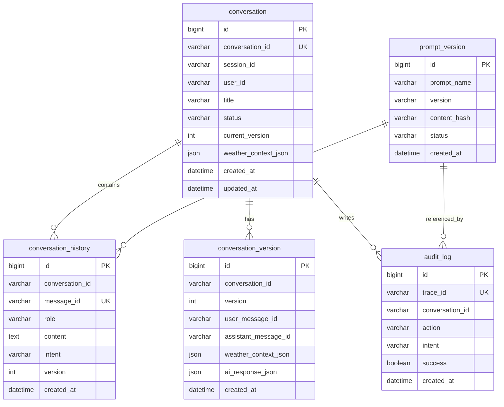
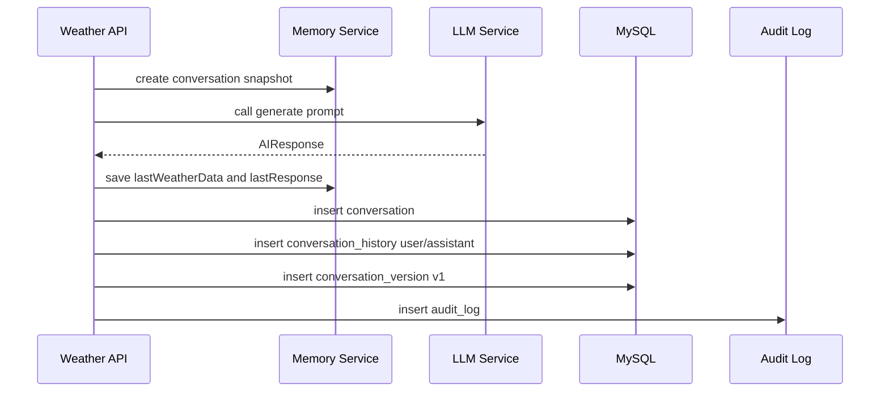
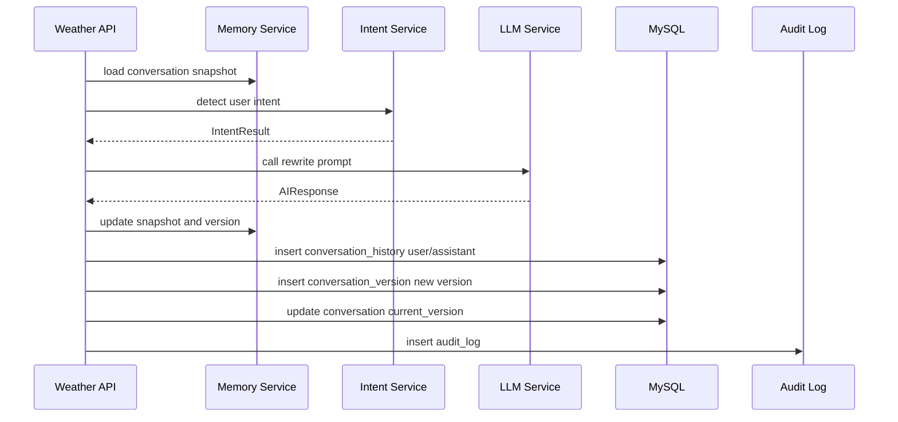

# 深圳市气象短临预报 AI Assistant 数据库设计

版本：v1.0  
状态：第一阶段数据库设计  
日期：2026-06-30  
目标数据库：MySQL 8.x  
当前实现策略：第一阶段可使用内存存储，表结构为后续持久化预留

## 1. 设计目标

数据库设计需要支持以下能力：

- 会话持久化。
- 多轮对话历史保存。
- 每次生成和改写的版本追踪。
- Prompt 版本审计。
- LLM 调用摘要和异常排查。
- 后续 Redis、MySQL、审计平台平滑接入。

第一阶段业务可以先用 `InMemoryRepository`，但领域模型和表结构必须提前对齐，避免后续接 MySQL 时重构业务层。

## 2. 设计原则

- 业务 ID 和数据库主键分离，外部只暴露 `conversation_id`、`message_id`、`trace_id`。
- 天气上下文、Prompt 快照、LLM 响应等复杂结构使用 JSON 字段保存，减少早期模型频繁变更带来的表结构震荡。
- 高频查询字段建立索引，例如 `conversation_id`、`session_id`、`trace_id`。
- 完整 Prompt 明文不进入普通日志，但可以受控存储 Prompt 版本和 Hash。
- 历史记录不可因会话重置被删除，重置只改变状态。

## 3. ER 图



## 4. 表结构

### 4.1 conversation

用途：保存一次预报任务的会话主表。

```sql
CREATE TABLE conversation (
    id BIGINT PRIMARY KEY AUTO_INCREMENT,
    conversation_id VARCHAR(64) NOT NULL,
    session_id VARCHAR(64) NOT NULL,
    user_id VARCHAR(64) NULL,
    title VARCHAR(255) NULL,
    status VARCHAR(32) NOT NULL DEFAULT 'ACTIVE',
    current_version INT NOT NULL DEFAULT 0,
    weather_context_json JSON NULL,
    created_at DATETIME NOT NULL DEFAULT CURRENT_TIMESTAMP,
    updated_at DATETIME NOT NULL DEFAULT CURRENT_TIMESTAMP ON UPDATE CURRENT_TIMESTAMP,
    UNIQUE KEY uk_conversation_id (conversation_id),
    KEY idx_session_id (session_id),
    KEY idx_user_id (user_id),
    KEY idx_status_updated_at (status, updated_at)
) ENGINE=InnoDB DEFAULT CHARSET=utf8mb4 COLLATE=utf8mb4_unicode_ci;
```

字段说明：

| 字段 | 说明 |
| --- | --- |
| conversation_id | 对外暴露的会话 ID |
| session_id | 前端或服务端生成的 Session ID |
| user_id | 用户 ID，第一阶段可为空 |
| title | 会话标题，可由首轮内容生成 |
| status | ACTIVE、CLOSED、RESET、EXPIRED |
| current_version | 当前最新版本 |
| weather_context_json | 最近一次 WeatherContext |

设计原因：

- `conversation` 只保存当前状态和最近上下文，避免每次查询都扫描历史。
- 完整版本内容放在 `conversation_version`。
- 重置会话只修改 `status`，不删除历史。

### 4.2 conversation_history

用途：保存多轮对话消息，包括用户输入和 AI 输出。

```sql
CREATE TABLE conversation_history (
    id BIGINT PRIMARY KEY AUTO_INCREMENT,
    conversation_id VARCHAR(64) NOT NULL,
    message_id VARCHAR(64) NOT NULL,
    role VARCHAR(32) NOT NULL,
    content TEXT NOT NULL,
    intent VARCHAR(64) NULL,
    intent_confidence DECIMAL(5,4) NULL,
    intent_parameters_json JSON NULL,
    version INT NOT NULL,
    prompt_name VARCHAR(64) NULL,
    prompt_version VARCHAR(32) NULL,
    prompt_hash VARCHAR(128) NULL,
    model_name VARCHAR(64) NULL,
    input_tokens INT NULL,
    output_tokens INT NULL,
    latency_ms BIGINT NULL,
    created_at DATETIME NOT NULL DEFAULT CURRENT_TIMESTAMP,
    UNIQUE KEY uk_message_id (message_id),
    KEY idx_conversation_version (conversation_id, version),
    KEY idx_conversation_created_at (conversation_id, created_at),
    KEY idx_intent_created_at (intent, created_at)
) ENGINE=InnoDB DEFAULT CHARSET=utf8mb4 COLLATE=utf8mb4_unicode_ci;
```

字段说明：

| 字段 | 说明 |
| --- | --- |
| role | USER、ASSISTANT、SYSTEM |
| content | 消息内容 |
| intent | 用户消息识别出的意图 |
| intent_parameters_json | Intent 参数 |
| version | 所属预报版本 |
| prompt_name | generate、rewrite、intent 等 |
| prompt_version | Prompt 版本 |
| prompt_hash | Prompt 内容 Hash |
| model_name | LLM 模型名称 |
| input_tokens/output_tokens | Token 统计 |
| latency_ms | LLM 或业务处理耗时 |

设计原因：

- 消息流是前端历史展示的主要数据源。
- 用户消息和助手消息都进入同一张表，方便按时间排序。
- 模型和 Prompt 摘要直接挂在助手消息上，便于问题排查。

### 4.3 conversation_version

用途：保存每个预报版本的快照，用于回看、审计、对比和回滚。

```sql
CREATE TABLE conversation_version (
    id BIGINT PRIMARY KEY AUTO_INCREMENT,
    conversation_id VARCHAR(64) NOT NULL,
    version INT NOT NULL,
    user_message_id VARCHAR(64) NULL,
    assistant_message_id VARCHAR(64) NOT NULL,
    intent VARCHAR(64) NOT NULL,
    changes_json JSON NULL,
    weather_context_json JSON NOT NULL,
    prompt_snapshot_json JSON NULL,
    ai_response_json JSON NOT NULL,
    created_at DATETIME NOT NULL DEFAULT CURRENT_TIMESTAMP,
    UNIQUE KEY uk_conversation_version (conversation_id, version),
    KEY idx_conversation_created_at (conversation_id, created_at),
    KEY idx_intent_created_at (intent, created_at)
) ENGINE=InnoDB DEFAULT CHARSET=utf8mb4 COLLATE=utf8mb4_unicode_ci;
```

字段说明：

| 字段 | 说明 |
| --- | --- |
| version | 预报版本号，从 1 开始 |
| user_message_id | 触发该版本的用户消息 |
| assistant_message_id | 该版本对应的 AI 输出消息 |
| intent | 本次生成或改写意图 |
| changes_json | 修改点摘要 |
| weather_context_json | 本版本使用的 WeatherContext |
| prompt_snapshot_json | Prompt 名称、版本、变量摘要、Hash |
| ai_response_json | AIResponse 完整结构 |

设计原因：

- `conversation_history` 适合消息流展示，`conversation_version` 适合版本快照。
- 改写场景必须能复现每一版结果所使用的天气数据和 Prompt 摘要。
- 后续支持版本对比时，不需要从消息流反推状态。

### 4.4 prompt_version

用途：保存 Prompt 文件版本信息。

```sql
CREATE TABLE prompt_version (
    id BIGINT PRIMARY KEY AUTO_INCREMENT,
    prompt_name VARCHAR(64) NOT NULL,
    version VARCHAR(32) NOT NULL,
    content_hash VARCHAR(128) NOT NULL,
    file_path VARCHAR(255) NOT NULL,
    status VARCHAR(32) NOT NULL DEFAULT 'DRAFT',
    change_log TEXT NULL,
    created_by VARCHAR(64) NULL,
    created_at DATETIME NOT NULL DEFAULT CURRENT_TIMESTAMP,
    updated_at DATETIME NOT NULL DEFAULT CURRENT_TIMESTAMP ON UPDATE CURRENT_TIMESTAMP,
    UNIQUE KEY uk_prompt_name_version (prompt_name, version),
    KEY idx_prompt_status (prompt_name, status),
    KEY idx_content_hash (content_hash)
) ENGINE=InnoDB DEFAULT CHARSET=utf8mb4 COLLATE=utf8mb4_unicode_ci;
```

字段说明：

| 字段 | 说明 |
| --- | --- |
| prompt_name | system、intent、generate、rewrite、explain |
| version | v1、v2 等 |
| content_hash | Prompt 内容 Hash |
| file_path | Prompt 文件路径 |
| status | DRAFT、ACTIVE、DEPRECATED |
| change_log | 变更说明 |

设计原因：

- Prompt 是 AI 应用的核心资产，必须版本化。
- LLM 输出问题需要定位到具体 Prompt 版本。
- Hash 可用于判断文件内容是否与登记版本一致。

### 4.5 audit_log

用途：保存接口调用、模型调用和异常排查所需的审计摘要。

```sql
CREATE TABLE audit_log (
    id BIGINT PRIMARY KEY AUTO_INCREMENT,
    trace_id VARCHAR(64) NOT NULL,
    request_id VARCHAR(64) NULL,
    conversation_id VARCHAR(64) NULL,
    session_id VARCHAR(64) NULL,
    user_id VARCHAR(64) NULL,
    action VARCHAR(64) NOT NULL,
    intent VARCHAR(64) NULL,
    request_summary_json JSON NULL,
    response_summary_json JSON NULL,
    model_name VARCHAR(64) NULL,
    prompt_name VARCHAR(64) NULL,
    prompt_version VARCHAR(32) NULL,
    prompt_hash VARCHAR(128) NULL,
    prompt_length INT NULL,
    input_tokens INT NULL,
    output_tokens INT NULL,
    llm_latency_ms BIGINT NULL,
    total_latency_ms BIGINT NULL,
    success TINYINT(1) NOT NULL,
    error_code VARCHAR(64) NULL,
    error_message VARCHAR(512) NULL,
    created_at DATETIME NOT NULL DEFAULT CURRENT_TIMESTAMP,
    UNIQUE KEY uk_trace_id (trace_id),
    KEY idx_conversation_created_at (conversation_id, created_at),
    KEY idx_session_created_at (session_id, created_at),
    KEY idx_action_created_at (action, created_at),
    KEY idx_success_created_at (success, created_at),
    KEY idx_error_code_created_at (error_code, created_at)
) ENGINE=InnoDB DEFAULT CHARSET=utf8mb4 COLLATE=utf8mb4_unicode_ci;
```

字段说明：

| 字段 | 说明 |
| --- | --- |
| trace_id | 单次请求链路 ID |
| request_id | 调用方请求 ID |
| action | GENERATE、CHAT、RESET、HISTORY、PROMPT_QUERY |
| request_summary_json | 请求摘要，避免存敏感全文 |
| response_summary_json | 响应摘要 |
| prompt_length | 最终 Prompt 长度 |
| llm_latency_ms | 模型调用耗时 |
| total_latency_ms | 接口总耗时 |
| success | 是否成功 |
| error_code | 失败业务码 |

设计原因：

- 审计表面向排查和统计，不等同于消息历史。
- 日志平台丢失时，数据库仍保留关键调用摘要。
- 统计 Intent、模型耗时、错误率时不需要扫描消息全文。

### 4.6 llm_call_record

用途：可选表，保存更细粒度的 LLM 调用记录。一个业务请求未来可能包含 Intent 分类调用、RAG 总结调用、最终生成调用等多次 LLM 调用。

```sql
CREATE TABLE llm_call_record (
    id BIGINT PRIMARY KEY AUTO_INCREMENT,
    trace_id VARCHAR(64) NOT NULL,
    conversation_id VARCHAR(64) NULL,
    call_type VARCHAR(64) NOT NULL,
    model_name VARCHAR(64) NOT NULL,
    provider VARCHAR(64) NOT NULL,
    prompt_name VARCHAR(64) NULL,
    prompt_version VARCHAR(32) NULL,
    prompt_hash VARCHAR(128) NULL,
    prompt_length INT NULL,
    input_tokens INT NULL,
    output_tokens INT NULL,
    latency_ms BIGINT NULL,
    success TINYINT(1) NOT NULL,
    error_code VARCHAR(64) NULL,
    created_at DATETIME NOT NULL DEFAULT CURRENT_TIMESTAMP,
    KEY idx_trace_id (trace_id),
    KEY idx_conversation_created_at (conversation_id, created_at),
    KEY idx_call_type_created_at (call_type, created_at),
    KEY idx_model_created_at (model_name, created_at)
) ENGINE=InnoDB DEFAULT CHARSET=utf8mb4 COLLATE=utf8mb4_unicode_ci;
```

字段说明：

| 字段 | 说明 |
| --- | --- |
| call_type | INTENT_DETECTION、GENERATE、REWRITE、EXPLAIN |
| provider | ALIYUN_BAILIAN、OPENAI_COMPATIBLE |
| prompt_length | 最终 Prompt 字符长度 |
| success | 该次 LLM 调用是否成功 |

设计原因：

- 审计日志记录业务请求级摘要，`llm_call_record` 记录模型调用级明细。
- 后续一个请求多次调用 LLM 时，可清晰拆分耗时和错误来源。
- 便于做模型成本和稳定性统计。

## 5. 状态与枚举

### 5.1 conversation.status

| 值 | 说明 |
| --- | --- |
| ACTIVE | 正常可继续改写 |
| CLOSED | 用户或系统关闭 |
| RESET | 用户重置，不能继续基于旧版本改写 |
| EXPIRED | 会话过期 |

### 5.2 conversation_history.role

| 值 | 说明 |
| --- | --- |
| USER | 用户输入 |
| ASSISTANT | AI 响应 |
| SYSTEM | 系统消息或提示 |

### 5.3 prompt_version.status

| 值 | 说明 |
| --- | --- |
| DRAFT | 草稿 |
| ACTIVE | 当前生效 |
| DEPRECATED | 已废弃 |

### 5.4 audit_log.action

| 值 | 说明 |
| --- | --- |
| GENERATE | 首次生成预报 |
| CHAT | 连续改写 |
| RESET | 重置会话 |
| HISTORY | 查询历史 |
| PROMPT_QUERY | 查询 Prompt |
| AUDIT_QUERY | 查询审计 |

## 6. Redis 设计

第一阶段使用内存实现，后续推荐引入 Redis 保存热会话。

### 6.1 Key 设计

| Key | 类型 | 说明 | TTL |
| --- | --- | --- | --- |
| `weather:conversation:{conversationId}` | String JSON | ConversationSnapshot | 24h 或 7d |
| `weather:conversation:{conversationId}:history` | List | 最近消息列表 | 24h 或 7d |
| `weather:session:{sessionId}` | Set | Session 下的 conversationId | 24h 或 7d |
| `weather:request:{requestId}` | String JSON | 幂等结果缓存 | 5m |

### 6.2 Redis 与 MySQL 分工

- Redis：保存热会话，提升连续改写性能。
- MySQL：保存最终审计和历史。
- 写入策略：生成成功后先更新 Redis，再异步或同步落 MySQL。
- 恢复策略：Redis 未命中时，从 MySQL 重建 ConversationSnapshot。

## 7. 数据写入流程

### 7.1 首次生成



### 7.2 连续改写



## 8. 索引设计说明

| 查询场景 | 使用索引 |
| --- | --- |
| 通过 conversationId 查询会话 | `conversation.uk_conversation_id` |
| 查询某 Session 下会话 | `conversation.idx_session_id` |
| 查询历史消息 | `conversation_history.idx_conversation_created_at` |
| 查询某版本消息 | `conversation_history.idx_conversation_version` |
| 查询版本快照 | `conversation_version.uk_conversation_version` |
| 查询 Prompt 当前状态 | `prompt_version.idx_prompt_status` |
| 通过 traceId 排查 | `audit_log.uk_trace_id` |
| 查询某会话审计 | `audit_log.idx_conversation_created_at` |
| 统计错误码 | `audit_log.idx_error_code_created_at` |

## 9. 数据保留策略

建议策略：

- Conversation 热数据：Redis 保留 24 小时到 7 天。
- MySQL conversation/history/version：默认保留 180 天。
- audit_log：默认保留 180 天，后续归档到对象存储或日志平台。
- llm_call_record：默认保留 90 天。
- Prompt Version：永久保留。

## 10. 脱敏与合规

- `audit_log.request_summary_json` 不保存完整敏感内容。
- 普通日志不保存完整 Prompt。
- 如需保存完整 Prompt 快照，必须存入受控字段并限制访问。
- API Key、模型密钥、用户凭证不进入数据库。
- 后续接入权限系统后，审计查询需按角色控制。

## 11. 迁移建议

推荐使用 Flyway：

```text
src/main/resources/db/migration
├── V1__create_conversation_tables.sql
├── V2__create_prompt_version_table.sql
├── V3__create_audit_log_table.sql
└── V4__create_llm_call_record_table.sql
```

迁移原则：

- 表结构变更必须走 migration。
- 不直接在生产数据库手工改表。
- JSON 字段新增内部字段时不一定需要改表。
- 高频查询字段从 JSON 提升为独立列时必须补索引。

## 12. 后续扩展

### 12.1 RAG 扩展

新增表：

- `knowledge_document`
- `knowledge_chunk`
- `retrieval_record`

用途：

- 保存历史个例、业务规则、预报规范。
- 记录每次生成引用了哪些知识片段。

### 12.2 MCP / Tool Calling 扩展

新增表：

- `tool_call_record`
- `tool_definition`

用途：

- 保存工具调用参数、结果摘要、耗时和错误。
- 支持查询雷达、预警、雨量站等外部系统。

### 12.3 人工审核扩展

新增表：

- `forecast_review`
- `forecast_publish_record`

用途：

- 保存人工审核意见。
- 记录最终发布版本。

## 13. 第一阶段落地建议

第一阶段可以不立即接 MySQL，但开发时应按以下方式实现：

- 领域对象字段与表结构保持一致。
- Repository 接口先有 InMemory 实现。
- 不把 Map 和 String 直接传遍业务层。
- 每次生成和改写都构造可持久化的 ConversationSnapshot。
- 日志字段与 `audit_log` 字段保持一致。

