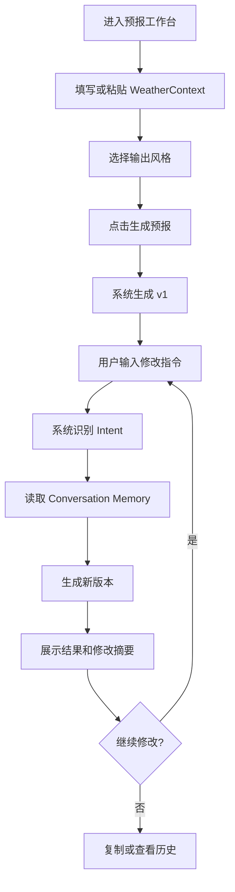
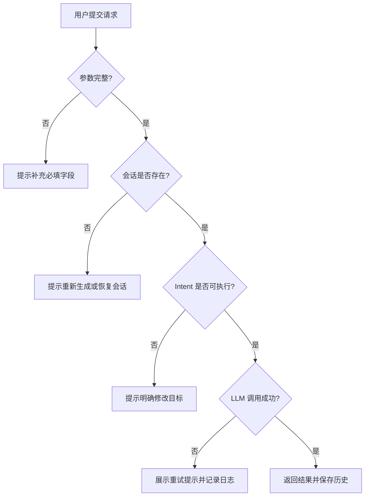

# 深圳市气象短临预报 AI Assistant PRD

版本：v1.0  
状态：第一阶段产品需求设计  
日期：2026-06-30  
产品定位：面向深圳短临天气预报业务的 AI 预报生成与连续改写助手  
技术约束：Java 21、Spring Boot 3.x、Spring AI、Maven、Vue3、RESTful API

## 1. 产品概述

### 1.1 产品背景

深圳短临预报业务需要在较短时间内把雷达回波、降雨趋势、分区影响、风险提示等信息整理成规范文本。不同发布对象对文本风格要求不同，例如公众提醒需要简明清晰，政务通报需要正式稳妥，业务研判需要包含更多气象细节。

当前人工改写存在重复劳动多、风格不统一、历史版本难追踪、修改意图难沉淀等问题。大模型可以提升文本生成效率，但真实业务不能只做一次性聊天调用，需要支持 Prompt 管理、意图识别、会话记忆、版本追踪和审计。

### 1.2 产品目标

构建一个“深圳市气象短临预报 AI Assistant”，支持业务人员基于结构化气象数据生成规范预报文本，并通过自然语言连续修改上一版结果。

核心目标：

- 将结构化 WeatherContext 转换为规范预报文本。
- 支持“简单一点”“专业一点”“再正式一点”“把雨量调大一点”“增加风险提示”等连续改写。
- 自动识别用户意图，不把连续修改当成全新聊天。
- 保存会话上下文、上一版结果、Prompt 版本和历史记录。
- 为后续接入 RAG、MCP、Function Calling、Tool Calling 保留产品边界。

### 1.3 产品价值

- 降低短临预报初稿和多版本改写成本。
- 提升预报文本规范性和一致性。
- 保留完整修改链路，便于复盘、审计和质量优化。
- 让 AI 能力嵌入真实业务流程，而不是停留在演示式问答。

## 2. 范围定义

### 2.1 本期范围

本 PRD 面向 MVP 到企业级可扩展版本的第一阶段产品设计，覆盖：

- 预报生成工作台。
- 结构化天气数据输入。
- AI 生成预报。
- 基于会话的连续改写。
- 意图识别结果展示。
- 历史版本查看。
- 会话重置。
- Prompt 版本和模型调用摘要展示。
- 异常提示和基础审计。

### 2.2 非本期范围

- 不接入真实雷达、卫星、自动站、数值预报数据源。
- 不实现最终业务签发流程。
- 不做模型训练或微调。
- 不做多租户权限体系。
- 不做线上 Prompt 编辑发布。
- 不实现完整 RAG、MCP、Function Calling、Tool Calling，只保留扩展入口。

### 2.3 产品边界

系统生成的预报文本为业务辅助结果，最终发布前必须由气象业务人员审核。系统不对气象事实本身负责，只基于用户提交的数据和已接入的数据源生成表达。

## 3. 用户角色

| 角色 | 使用目标 | 核心权限 |
| --- | --- | --- |
| 气象预报员 | 生成初稿、调整表达、查看版本 | 生成、改写、复制、查看历史 |
| 值班人员 | 快速产出清晰预警提示和业务通报 | 生成、改写、重置会话 |
| 业务主管 | 查看生成依据、审计记录和质量情况 | 查看历史、查看日志摘要 |
| 系统管理员 | 管理模型配置、Prompt 版本、异常排查 | 查看配置、查看审计、管理 Prompt 版本 |

## 4. 典型业务场景

### 4.1 首次生成短临预报

用户输入雷达回波、降雨等级、影响区域、有效期、风险提示等结构化数据，系统生成一版规范预报。

成功标准：

- 返回一段可直接审核的天气预报文本。
- 创建 conversationId。
- 当前版本号为 1。
- 保存 WeatherContext、Prompt 版本、模型摘要和响应结果。

### 4.2 连续简化文本

用户在已有预报基础上输入“简单一点”。系统识别为 SIMPLIFY，并基于上一版预报生成更短版本。

成功标准：

- 不要求用户重新输入天气数据。
- 新版本保留核心天气事实。
- 版本号递增。
- 历史记录可查看原始版本和简化版本。

### 4.3 调整表达风格

用户输入“再正式一点”或“通俗一点”。系统识别为 MORE_FORMAL 或 MORE_CASUAL，并调整措辞风格。

成功标准：

- 气象事实不被随意改变。
- 文风变化明显。
- 修改原因可在响应摘要中查看。

### 4.4 修改雨量表达

用户输入“把雨量调大一点”。系统识别为 INCREASE_RAIN，在不改变原始数据结构的前提下调整文本表达强度，必要时提示该操作会影响业务口径。

成功标准：

- 系统基于 Intent 参数生成改写结果。
- 保留原 WeatherContext。
- 在 changes 中记录“雨量表达增强”。
- 如果用户要求明显违背数据，系统需要提示风险。

### 4.5 增加风险提示

用户输入“增加风险提示”。系统识别为 ADD_WARNING，补充短时强降水、道路积水、低洼区域、交通影响等提示。

成功标准：

- 新版本包含独立或清晰的风险提示语句。
- 不夸大超出数据支持的风险。
- 可在历史中追踪该修改意图。

## 5. 用户流程

### 5.1 主流程

### 5.2 异常流程

## 6. 功能需求

### 6.1 预报生成

| 项 | 内容 |
| --- | --- |
| 功能描述 | 根据 WeatherContext 生成短临天气预报 |
| 优先级 | P0 |
| 输入 | sessionId、WeatherContext、style |
| 输出 | conversationId、version、content、promptVersion、modelName、latencyMs |
| 规则 | 必须包含有效期、影响区域、降雨趋势；不得凭空生成气象数据 |

验收标准：

- 给定完整 WeatherContext，系统能生成 v1 预报。
- 响应包含 conversationId 和 version。
- 历史中可查到用户输入和 AI 输出。
- 日志包含 traceId、intent、latency、promptVersion。

### 6.2 连续改写

| 项 | 内容 |
| --- | --- |
| 功能描述 | 基于上一版结果进行自然语言改写 |
| 优先级 | P0 |
| 输入 | conversationId、sessionId、message |
| 输出 | 新版本 content、intent、changes、version |
| 规则 | 改写必须基于 lastWeatherData 和 lastResponse |

验收标准：

- 输入“简单一点”后，系统生成更简洁版本。
- 输入“正式一点”后，系统生成更正式版本。
- 输入“增加风险提示”后，系统补充风险提示。
- 每次改写版本号递增。

### 6.3 Intent Recognition

| 项 | 内容 |
| --- | --- |
| 功能描述 | 识别用户自然语言修改意图 |
| 优先级 | P0 |
| 输入 | userMessage、conversationState |
| 输出 | intent、confidence、parameters、reason |
| 规则 | 规则识别优先，LLM 分类兜底 |

支持 Intent：

- GENERATE
- SIMPLIFY
- MORE_DETAIL
- MORE_FORMAL
- MORE_CASUAL
- INCREASE_RAIN
- DECREASE_RAIN
- ADD_WARNING
- REGENERATE
- UNKNOWN

验收标准：

- 高频短语识别准确率满足演示和测试用例。
- UNKNOWN 不直接调用生成 Prompt。
- 对需要历史上下文的 Intent，若缺少 lastResponse，返回明确提示。

### 6.4 Conversation Memory

| 项 | 内容 |
| --- | --- |
| 功能描述 | 保存会话上下文、历史消息和版本快照 |
| 优先级 | P0 |
| 输入 | conversationId、message、AIResponse、WeatherContext |
| 输出 | ConversationSnapshot |
| 规则 | 每次成功生成后保存，失败请求不写入成功历史 |

验收标准：

- 可读取 lastWeatherData、lastResponse、lastPrompt。
- 可查询完整历史。
- 可重置会话。
- 存储实现可从内存替换为 Redis。

### 6.5 历史版本查看

| 项 | 内容 |
| --- | --- |
| 功能描述 | 查看某个 conversation 的历史版本 |
| 优先级 | P1 |
| 输入 | conversationId、sessionId |
| 输出 | messages、versions、currentVersion |
| 规则 | 按时间顺序展示，标记用户指令和 AI 响应 |

验收标准：

- 可查看 v1、v2、v3 的内容。
- 可查看每一版对应 Intent。
- 可复制任意版本文本。

### 6.6 会话重置

| 项 | 内容 |
| --- | --- |
| 功能描述 | 清空当前 conversation 的上下文状态 |
| 优先级 | P1 |
| 输入 | conversationId、sessionId |
| 输出 | status |
| 规则 | 重置后不能继续基于旧响应改写 |

验收标准：

- 重置后状态为 RESET。
- 再输入“简单一点”时提示需要先生成预报。
- 审计日志记录 RESET 操作。

### 6.7 Prompt 版本展示

| 项 | 内容 |
| --- | --- |
| 功能描述 | 展示本次调用使用的 Prompt 名称和版本 |
| 优先级 | P1 |
| 输入 | LLM 调用结果 |
| 输出 | promptName、promptVersion、contentHash |
| 规则 | 普通用户不展示完整 Prompt 明文 |

验收标准：

- 每次生成响应包含 promptVersion。
- 审计中保存 promptName 和 contentHash。

### 6.8 错误提示

| 项 | 内容 |
| --- | --- |
| 功能描述 | 对参数、会话、意图、LLM 调用异常给出明确反馈 |
| 优先级 | P0 |
| 输入 | 异常类型 |
| 输出 | errorCode、message、traceId |
| 规则 | 用户提示清晰，日志保留排查信息 |

验收标准：

- 参数缺失返回 INVALID_REQUEST。
- 会话不存在返回 CONVERSATION_NOT_FOUND。
- 缺少上一版响应返回 NO_PREVIOUS_RESPONSE。
- LLM 失败返回 LLM_CALL_FAILED。

## 7. 页面需求

### 7.1 预报工作台

页面目标：让用户完成天气数据输入、预报生成、连续改写和结果复制。

主要区域：

- 天气数据输入区：结构化表单和 JSON 输入切换。
- 生成控制区：输出风格、有效期、模型显示、生成按钮。
- 结果区：当前版本、预报正文、风险提示、修改摘要。
- 对话改写区：输入自然语言修改指令。
- 历史入口：查看历史版本。

关键交互：

- 用户填写 WeatherContext 后点击生成。
- 生成中显示 loading，不允许重复提交。
- 生成成功后自动进入 conversation。
- 用户输入修改指令后按 Enter 或点击发送。
- 新版本生成后保留上一版历史，不覆盖历史数据。

### 7.2 历史版本页

页面目标：支持查看和复制不同版本的预报文本。

展示内容：

- version
- createdAt
- userMessage
- intent
- AI content
- changes
- promptVersion
- modelName
- latencyMs

关键交互：

- 点击版本查看详情。
- 点击复制当前版本文本。
- 支持返回工作台继续从最新版本改写。

### 7.3 Prompt 信息页

页面目标：展示 Prompt 版本和状态，辅助管理和排查。

展示内容：

- promptName
- version
- status
- contentHash
- updatedAt
- changeLog

本期限制：

- 只读展示。
- 不支持在线编辑 Prompt。
- 不支持未审核 Prompt 直接发布。

### 7.4 审计日志页

页面目标：支持按 traceId 或 conversationId 排查问题。

展示内容：

- traceId
- action
- intent
- modelName
- promptVersion
- totalLatencyMs
- llmLatencyMs
- success
- errorCode

本期限制：

- 默认只展示摘要。
- 完整 Prompt 和响应内容需要更高权限。

## 8. 数据需求

### 8.1 WeatherContext

必填字段：

- city
- forecastTime
- validPeriod
- rainForecast

建议字段：

- radarInfo
- regionForecasts
- riskSignals
- dataSource

### 8.2 ConversationSnapshot

必须保存：

- conversationId
- sessionId
- history
- lastWeatherData
- lastPrompt
- lastResponse
- lastIntent
- version
- promptVersion

### 8.3 AIResponse

必须返回：

- responseId
- content
- modelName
- promptVersion
- latencyMs

可选返回：

- structuredSections
- inputTokens
- outputTokens
- changes

## 9. 接口需求

### 9.1 生成预报

`POST /api/weather/generate`

用于首次生成预报，并创建 conversation。

必填：

- sessionId
- weatherContext

返回：

- conversationId
- version
- intent
- content
- promptVersion
- modelName
- latencyMs

### 9.2 连续改写

`POST /api/weather/chat`

用于基于已有 conversation 连续修改。

必填：

- conversationId
- sessionId
- message

返回：

- conversationId
- version
- intent
- content
- changes
- latencyMs

### 9.3 查询历史

`GET /api/conversation/history`

用于查询会话历史。

必填：

- conversationId
- sessionId

返回：

- conversationId
- currentVersion
- messages

### 9.4 重置会话

`POST /api/conversation/reset`

用于重置当前会话上下文。

必填：

- conversationId
- sessionId

返回：

- conversationId
- status

## 10. 业务规则

### 10.1 事实一致性

- 系统不得凭空增加未在 WeatherContext 中出现的雨量数值。
- 风险提示必须和天气上下文匹配。
- 调大或调小雨量表达时，需要保持在原始数据可解释范围内。

### 10.2 多轮对话

- 只有成功生成过 v1 的 conversation 才能执行改写 Intent。
- 每次成功改写都生成新版本。
- 用户输入可以包含多个修改要求，系统应识别主 Intent 和参数。

### 10.3 版本管理

- 首次生成版本为 1。
- 每次成功改写版本递增。
- 查询历史时不能丢失旧版本。
- 重置后不删除审计记录。

### 10.4 Prompt 管理

- Prompt 文件化，不写入 Java 代码。
- 每次调用记录 Prompt 版本。
- Prompt 修改应有版本号和变更记录。

## 11. 异常与边界条件

| 场景 | 系统行为 |
| --- | --- |
| WeatherContext 缺少必填字段 | 返回 INVALID_REQUEST，并提示缺少字段 |
| 用户未生成预报就输入“简单一点” | 返回 NO_PREVIOUS_RESPONSE |
| conversationId 不存在 | 返回 CONVERSATION_NOT_FOUND |
| Intent 识别为 UNKNOWN | 提示用户明确要生成或修改什么 |
| LLM 超时 | 返回 LLM_CALL_FAILED，允许重试 |
| LLM 输出为空 | 返回 LLM_EMPTY_RESPONSE，记录日志 |
| 用户要求生成非气象内容 | 拒绝处理并引导回预报任务 |
| 用户要求明显违背数据 | 提示风险，不直接生成不实预报 |
| 会话过期 | 提示重新生成预报 |

## 12. 非功能需求

### 12.1 性能

- 预报生成接口 P95 响应时间目标小于 5 秒。
- Intent 识别 P95 响应时间目标小于 1.5 秒。
- 历史查询 P95 响应时间目标小于 500 毫秒。

### 12.2 可用性

- 核心接口应具备清晰错误码。
- LLM 失败不能导致服务整体不可用。
- 失败请求需要保留 traceId，便于排查。

### 12.3 可观测性

每次请求必须记录：

- traceId
- conversationId
- action
- intent
- modelName
- promptVersion
- promptLength
- inputTokens
- outputTokens
- llmLatencyMs
- totalLatencyMs
- success
- errorCode

### 12.4 安全

- API Key 不允许进入日志。
- 普通日志不记录完整 Prompt 明文。
- 用户输入和 AI 输出需要支持脱敏摘要。
- 后续接入权限体系后，审计页按角色授权。

### 12.5 可维护性

- Prompt 与 Java 代码分离。
- Controller 不包含业务编排。
- Memory 存储通过接口抽象。
- LLM 供应商通过 Spring AI 和服务适配隔离。

### 12.6 可扩展性

- 后续接入 Redis 不影响业务层。
- 后续接入 MySQL 不改变 API。
- 后续接入 RAG、MCP、Function Calling、Tool Calling 不修改 Controller。
- 新增 Intent 不需要重构会话模型。

## 13. 验收标准

### 13.1 MVP 验收

- 可提交 WeatherContext 生成 v1 预报。
- 可输入“简单一点”生成 v2。
- 可输入“正式一点”生成 v3。
- 可输入“增加风险提示”生成 v4。
- 可查询完整历史。
- 可重置会话。
- 响应和日志包含 traceId、intent、promptVersion、latency。

### 13.2 企业级设计验收

- 文档中有明确模块边界。
- 产品流程支持连续修改，不是单轮聊天。
- 数据结构支持版本追踪。
- API 返回结构统一。
- 异常场景有明确错误码。
- 后续扩展 RAG/MCP/Tool Calling 不破坏当前产品边界。

## 14. 指标体系

### 14.1 业务指标

- 每日生成预报次数。
- 平均每个 conversation 的改写次数。
- 最常用 Intent 分布。
- 用户复制结果次数。
- 生成后人工修改比例。

### 14.2 质量指标

- Intent 识别准确率。
- LLM 输出为空比例。
- 用户重试率。
- 低置信度 Intent 占比。
- Prompt 版本效果对比。

### 14.3 技术指标

- 生成接口 P50/P95/P99。
- LLM 调用耗时。
- Token 使用量。
- LLM 错误率。
- 会话读取失败率。

## 15. 迭代计划

### Sprint 1：产品和工程骨架

- 完成产品需求评审。
- 初始化 Spring Boot 和 Vue 项目。
- 建立统一响应、错误码、TraceId。
- 完成基础页面框架。

### Sprint 2：Prompt 与生成

- 实现 Prompt 文件加载。
- 实现 Generate Prompt。
- 打通 `/api/weather/generate`。
- 前端支持 WeatherContext 输入和结果展示。

### Sprint 3：Intent 与改写

- 实现 IntentType、IntentResult。
- 实现规则 Intent 识别。
- 实现 Rewrite Prompt。
- 打通 `/api/weather/chat`。

### Sprint 4：Conversation Memory

- 实现会话快照。
- 实现历史保存和版本递增。
- 实现历史查询和会话重置。
- 前端支持历史版本查看。

### Sprint 5：Spring AI 强化

- 接入阿里百炼/OpenAI Compatible。
- 增加超时、错误处理、模型摘要。
- 增加 Token 和耗时统计。

### Sprint 6：可观测与审计

- 增加结构化日志。
- 增加审计数据结构。
- 增加 Prompt 版本展示。
- 增加异常排查页面雏形。

### Sprint 7：体验优化

- 优化表单输入。
- 增加常用修改指令快捷按钮。
- 优化 loading、错误提示和复制体验。
- 增加输出格式校验。

### Sprint 8：测试与交付

- 完成核心单元测试。
- 完成接口集成测试。
- 完成主流程 E2E 测试。
- 输出演示脚本和部署说明。

## 16. 风险与应对

| 风险 | 影响 | 应对 |
| --- | --- | --- |
| LLM 输出不稳定 | 预报文本质量波动 | 强化 Prompt 约束、输出校验、人工审核 |
| Intent 识别错误 | 修改方向错误 | 规则优先、置信度阈值、低置信度澄清 |
| 用户要求违背数据 | 产生不实预报 | 事实一致性规则和风险提示 |
| Prompt 版本混乱 | 结果不可复现 | Prompt 版本、Hash 和审计 |
| 模型供应商异常 | 服务不可用 | 超时、重试、降级和供应商抽象 |
| 会话数据丢失 | 无法连续修改 | Memory Repository 抽象，后续接 Redis/MySQL |

## 17. 发布策略

第一阶段以内部演示和技术评审为目标：

- 只面向内部用户开放。
- 默认不接真实生产发布链路。
- 所有生成内容标记为“AI 辅助生成，需人工审核”。
- 记录完整链路，便于复盘和优化。

第二阶段接入真实业务数据前，需要补充：

- 用户登录和权限。
- 数据源可信性校验。
- 发布审核流程。
- 安全合规审查。
- 生产级监控告警。

